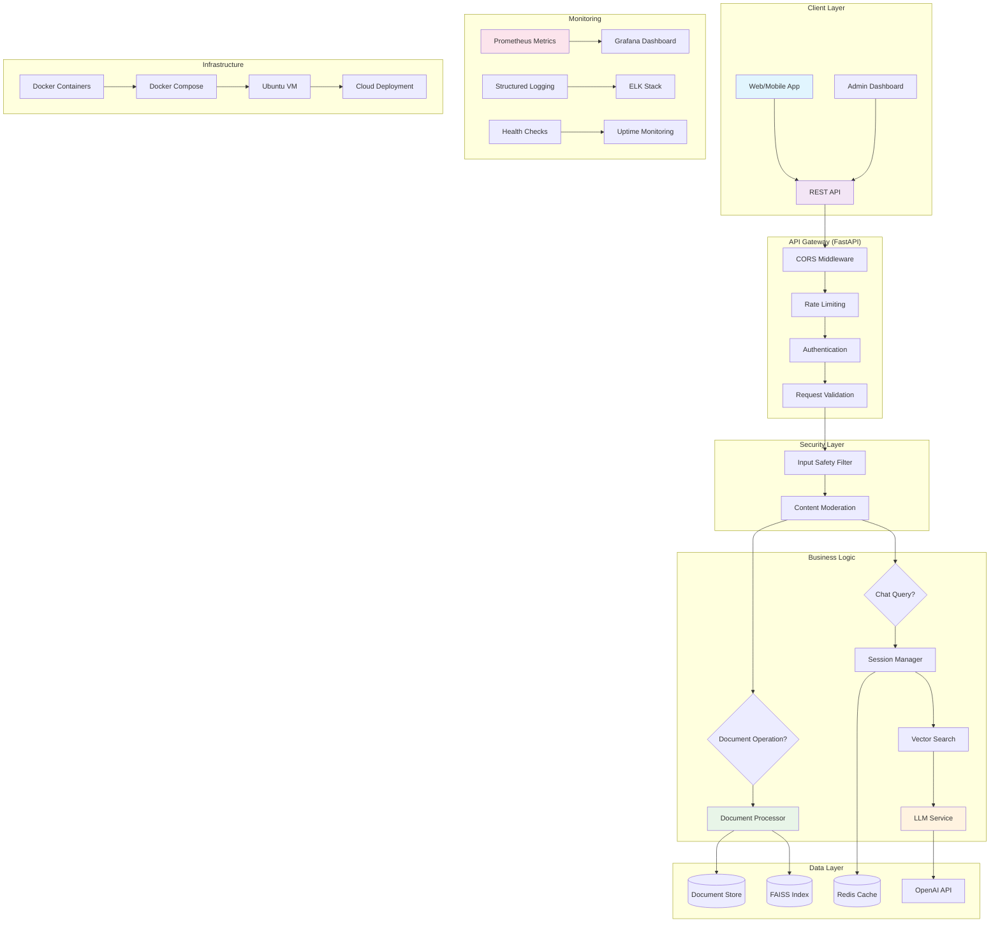

# RAG Chatbot — Production-Ready Document AI Assistant

A high-performance, enterprise-grade Retrieval-Augmented Generation (RAG) chatbot built with FastAPI, featuring multi-layer security, real-time metrics, document lifecycle management, and scalable vector search.

[](https://python.org)
[](https://fastapi.tiangolo.com)
[](https://docker.com)
[](LICENSE)

---

## 📋 Table of Contents

- [System Overview](#-system-overview)
- [Architecture & Flow](#-architecture--flow)
- [Key Features](#-key-features)
- [Prerequisites](#-prerequisites)
- [Local Development (Windows)](#-local-development-windows)
- [Production Deployment (Ubuntu VM)](#-production-deployment-ubuntu-vm)
- [API Reference](#-api-reference)
- [Configuration](#-configuration)
- [Monitoring & Observability](#-monitoring--observability)
- [Security Features](#-security-features)
- [Troubleshooting](#-troubleshooting)
- [Development](#-development)

---

## 🎯 System Overview

This RAG chatbot provides intelligent document-grounded conversations with enterprise-grade features:

- **Document Processing**: PDF, DOCX, TXT, MD files with selective lifecycle management
- **Vector Search**: FAISS-powered semantic search with IVF indexing for scalability
- **AI Generation**: OpenAI GPT integration with fallback stub mode
- **Security**: Multi-layer input/output filtering, rate limiting, CORS
- **Observability**: Prometheus metrics, structured logging, health checks
- **Scalability**: Redis-backed sessions, connection pooling, async processing
- **Production Ready**: Docker containerization, graceful shutdown, error handling

### Core Components

| Component | Technology | Purpose |
|-----------|------------|---------|
| **API Layer** | FastAPI + Pydantic | RESTful endpoints with auto-validation |
| **Document Processor** | FAISS + sentence-transformers | Vector indexing and retrieval |
| **LLM Service** | OpenAI GPT-3.5-turbo | AI-powered response generation |
| **Session Manager** | Redis | Multi-turn conversation history |
| **Safety Filter** | Regex + ML patterns | Content security and moderation |
| **Metrics** | Prometheus | Performance monitoring |
| **Storage** | Local filesystem + Redis | Document storage and caching |

---

## 🏗️ Architecture & Flow



### System Flow

1. **Document Ingestion**:
   ```
   File Upload → Content Validation → Text Extraction → Chunking → Embedding → FAISS Indexing → Storage
   ```

2. **Query Processing**:
   ```
   User Query → Input Filtering → Session Retrieval → Vector Search → Context Assembly → LLM Generation → Output Filtering → Response
   ```

3. **Document Management**:
   ```
   CRUD Operations → Selective Indexing → Metadata Updates → Search Index Synchronization
   ```

---

## ✨ Key Features

### 🔒 Security & Safety
- **Multi-layer filtering**: Input validation, content moderation, output scanning
- **Rate limiting**: Configurable request throttling per endpoint
- **CORS protection**: Configurable cross-origin policies
- **Malware detection**: Pattern-based file content analysis
- **Authentication ready**: JWT token support infrastructure

### 📊 Observability
- **Prometheus metrics**: Request latency, error rates, document processing stats
- **Health endpoints**: Application and dependency health checks
- **Structured logging**: JSON-formatted logs with correlation IDs
- **Performance monitoring**: Memory usage, CPU utilization tracking

### 🚀 Performance & Scalability
- **Async processing**: Non-blocking I/O for concurrent requests
- **Vector optimization**: FAISS IVF indexing for sub-linear search
- **Connection pooling**: Redis connection reuse and management
- **Thread safety**: RLock-protected concurrent document operations

### 📁 Document Management
- **Multi-format support**: PDF, DOCX, TXT, MD files
- **Selective operations**: Update, replace, delete documents without full re-indexing
- **Content validation**: File integrity and malware scanning
- **Metadata tracking**: Document statistics and indexing status

### 🤖 AI & NLP
- **RAG implementation**: Context-grounded responses with source attribution
- **Confidence gating**: Low-confidence responses with fallback handling
- **Multi-turn conversations**: Session persistence with Redis
- **Fallback mode**: Stub LLM for development without API keys

---

## 📋 Prerequisites

### System Requirements
- **Python**: 3.9 or higher
- **Memory**: 4GB RAM minimum, 8GB recommended
- **Storage**: 2GB free space for models and data
- **Network**: Internet connection for OpenAI API

### Dependencies
- **Core**: FastAPI, Uvicorn, Pydantic
- **AI/ML**: sentence-transformers, faiss-cpu, openai
- **Data**: numpy, redis, python-multipart
- **Utils**: python-dotenv, httpx, pydantic-settings

---

## 🪟 Local Development (Windows)

### 1. Environment Setup

```powershell
# Clone repository
git clone <repository-url>
cd rag-chatbot

# Create virtual environment
python -m venv venv
venv\Scripts\activate

# Upgrade pip
python -m pip install --upgrade pip
```

### 2. Install Dependencies

```powershell
# Install all requirements
pip install -r requirements.txt

# For development (optional)
pip install pytest black flake8 mypy
```

### 3. Configuration

```powershell
# Copy environment template
copy .env.example .env

# Edit .env file with your settings
notepad .env
```

**Required environment variables:**
```env
# OpenAI API (optional - uses stub mode if not set)
OPENAI_API_KEY=sk-your-openai-api-key-here

# Redis (optional - uses in-memory if not set)
REDIS_URL=redis://localhost:6379

# Application settings
APP_ENV=development
LOG_LEVEL=INFO
```

### 4. Run Development Server

```powershell
# Start with hot-reload
python run.py --reload

# Or use uvicorn directly
uvicorn app.main:app --reload --host 0.0.0.0 --port 8000
```

**Server URLs:**
- **API**: http://localhost:8000
- **Swagger Docs**: http://localhost:8000/docs
- **ReDoc**: http://localhost:8000/redoc
- **Health Check**: http://localhost:8000/health
- **Metrics**: http://localhost:8000/metrics

### 5. Test the Setup

```powershell
# Run health check
curl http://localhost:8000/health

# Upload a test document
curl -X POST http://localhost:8000/api/v1/documents/upload ^
  -F "file=@data/sample_document.txt"

# Test chat functionality
curl -X POST http://localhost:8000/api/v1/chat ^
  -H "Content-Type: application/json" ^
  -d "{\"query\": \"What is this document about?\"}"
```

### 6. Run Tests

```powershell
# Run all tests
python -m pytest tests/ -v

# Run specific test
python -m pytest tests/test_api.py::test_health -v

# Run with coverage
python -m pytest tests/ --cov=app --cov-report=html
```

---

## 🐧 Production Deployment (Ubuntu VM)

### 1. Server Preparation

```bash
# Update system
sudo apt update && sudo apt upgrade -y

# Install essential packages
sudo apt install -y curl wget git htop ufw

# Install Python 3.9+
sudo apt install -y python3.9 python3.9-venv python3-pip

# Install Docker and Docker Compose
sudo apt install -y docker.io docker-compose
sudo systemctl enable docker
sudo systemctl start docker

# Add user to docker group
sudo usermod -aG docker $USER
```

### 2. Application Deployment

```bash
# Clone repository
git clone <repository-url>
cd rag-chatbot

# Create production directories
sudo mkdir -p /opt/rag-chatbot
sudo chown $USER:$USER /opt/rag-chatbot

# Copy application
cp -r . /opt/rag-chatbot/
cd /opt/rag-chatbot
```

### 3. Environment Configuration

```bash
# Create production environment file
cp .env.example .env

# Edit with production settings
nano .env
```

**Production environment variables:**
```env
# Application
APP_ENV=production
LOG_LEVEL=WARNING
DEBUG=false

# OpenAI (required for production)
OPENAI_API_KEY=sk-your-production-api-key

# Redis (recommended for production)
REDIS_URL=redis://localhost:6379

# Security
SECRET_KEY=your-256-bit-secret-key-here
CORS_ORIGINS=https://yourdomain.com,https://app.yourdomain.com

# Performance
MAX_WORKERS=4
CHUNK_SIZE=512
CHUNK_OVERLAP=50
```

### 4. Redis Setup (Recommended)

```bash
# Install Redis
sudo apt install -y redis-server

# Configure Redis
sudo nano /etc/redis/redis.conf
# Set: supervised systemd
# Set: maxmemory 256mb
# Set: maxmemory-policy allkeys-lru

# Start Redis
sudo systemctl enable redis-server
sudo systemctl start redis-server

# Test Redis
redis-cli ping
```

### 5. Docker Deployment (Option A - Recommended)

```bash
# Build and run with Docker Compose
docker-compose up --build -d

# Check container status
docker-compose ps

# View logs
docker-compose logs -f api

# Scale if needed
docker-compose up -d --scale api=3
```

### 6. Systemd Service (Option B - Alternative)

```bash
# Create systemd service
sudo nano /etc/systemd/system/rag-chatbot.service
```

**Service file content:**
```ini
[Unit]
Description=RAG Chatbot API
After=network.target redis-server.service

[Service]
Type=simple
User=ubuntu
WorkingDirectory=/opt/rag-chatbot
Environment=PATH=/opt/rag-chatbot/venv/bin
ExecStart=/opt/rag-chatbot/venv/bin/python run.py
Restart=always
RestartSec=5

[Install]
WantedBy=multi-user.target
```

```bash
# Enable and start service
sudo systemctl daemon-reload
sudo systemctl enable rag-chatbot
sudo systemctl start rag-chatbot

# Check status
sudo systemctl status rag-chatbot
```

### 7. Nginx Reverse Proxy (Recommended)

```bash
# Install Nginx
sudo apt install -y nginx

# Create site configuration
sudo nano /etc/nginx/sites-available/rag-chatbot
```

**Nginx configuration:**
```nginx
server {
    listen 80;
    server_name your-domain.com;

    # Security headers
    add_header X-Frame-Options "SAMEORIGIN" always;
    add_header X-XSS-Protection "1; mode=block" always;
    add_header X-Content-Type-Options "nosniff" always;
    add_header Referrer-Policy "no-referrer-when-downgrade" always;
    add_header Content-Security-Policy "default-src 'self' http: https: data: blob: 'unsafe-inline'" always;

    # Rate limiting
    limit_req_zone $binary_remote_addr zone=api:10m rate=10r/s;
    limit_req zone=api burst=20 nodelay;

    location / {
        proxy_pass http://127.0.0.1:8000;
        proxy_set_header Host $host;
        proxy_set_header X-Real-IP $remote_addr;
        proxy_set_header X-Forwarded-For $proxy_add_x_forwarded_for;
        proxy_set_header X-Forwarded-Proto $scheme;

        # Timeout settings
        proxy_connect_timeout 30s;
        proxy_send_timeout 30s;
        proxy_read_timeout 30s;
    }

    # Static files (if serving frontend)
    location /static/ {
        alias /opt/rag-chatbot/static/;
        expires 1y;
        add_header Cache-Control "public, immutable";
    }
}
```

```bash
# Enable site
sudo ln -s /etc/nginx/sites-available/rag-chatbot /etc/nginx/sites-enabled/
sudo nginx -t
sudo systemctl reload nginx
```

### 8. SSL Certificate (Let's Encrypt)

```bash
# Install Certbot
sudo apt install -y certbot python3-certbot-nginx

# Get SSL certificate
sudo certbot --nginx -d your-domain.com

# Test renewal
sudo certbot renew --dry-run
```

### 9. Monitoring Setup

```bash
# Install Prometheus and Grafana (optional)
sudo apt install -y prometheus grafana

# Configure Prometheus to scrape metrics from /metrics endpoint
sudo nano /etc/prometheus/prometheus.yml
```

**Add to prometheus.yml:**
```yaml
scrape_configs:
  - job_name: 'rag-chatbot'
    static_configs:
      - targets: ['localhost:8000']
    metrics_path: '/metrics'
```

### 10. Backup Configuration

```bash
# Create backup script
sudo nano /opt/rag-chatbot/backup.sh
```

**Backup script:**
```bash
#!/bin/bash
BACKUP_DIR="/opt/rag-chatbot/backups"
DATE=$(date +%Y%m%d_%H%M%S)

# Create backup directory
mkdir -p $BACKUP_DIR

# Backup data directory
tar -czf $BACKUP_DIR/data_$DATE.tar.gz data/

# Backup Redis data (if using Redis)
# redis-cli --rdb /opt/rag-chatbot/backups/redis_$DATE.rdb

# Clean old backups (keep last 7 days)
find $BACKUP_DIR -name "*.tar.gz" -mtime +7 -delete

echo "Backup completed: $DATE"
```

```bash
# Make executable and schedule
chmod +x /opt/rag-chatbot/backup.sh
crontab -e
# Add: 0 2 * * * /opt/rag-chatbot/backup.sh
```

### 11. Firewall Configuration

```bash
# Configure UFW
sudo ufw allow OpenSSH
sudo ufw allow 'Nginx Full'
sudo ufw --force enable

# Check status
sudo ufw status
```

### 12. Production Testing

```bash
# Test API endpoints
curl -H "Host: your-domain.com" http://localhost/health
curl -H "Host: your-domain.com" http://localhost/api/v1/documents/status

# Test SSL
curl -I https://your-domain.com/health

# Monitor logs
sudo journalctl -u rag-chatbot -f
docker-compose logs -f  # if using Docker
```

---

## 📚 API Reference

### Core Endpoints

| Method | Endpoint | Description |
|--------|----------|-------------|
| `GET` | `/health` | Application health check |
| `GET` | `/metrics` | Prometheus metrics |
| `POST` | `/api/v1/documents/upload` | Upload and index document |
| `POST` | `/api/v1/documents/text` | Index raw text |
| `GET` | `/api/v1/documents` | List all documents |
| `GET` | `/api/v1/documents/{filename}` | Get document info |
| `PUT` | `/api/v1/documents/{filename}` | Update/replace document |
| `DELETE` | `/api/v1/documents/{filename}` | Delete document |
| `POST` | `/api/v1/documents/reindex` | Re-index all documents |
| `POST` | `/api/v1/chat` | Chat with documents |

### Document Upload Example

```bash
curl -X POST https://your-domain.com/api/v1/documents/upload \
  -H "Authorization: Bearer your-token" \
  -F "file=@document.pdf"
```

**Response:**
```json
{
  "message": "Successfully indexed 'document.pdf'",
  "chunks_indexed": 45,
  "filename": "document.pdf",
  "total_chunks": 1250,
  "file_hash": "a1b2c3d4..."
}
```

### Chat Example

```bash
curl -X POST https://your-domain.com/api/v1/chat \
  -H "Content-Type: application/json" \
  -d '{
    "query": "What is the company policy on remote work?",
    "session_id": "session-123",
    "top_k": 3
  }'
```

**Response:**
```json
{
  "answer": "According to company policy, employees can work remotely up to 3 days per week...",
  "sources": [
    {
      "content": "Remote Work Policy: Employees are eligible for...",
      "source": "hr-policy.pdf",
      "score": 0.923
    }
  ],
  "session_id": "session-123",
  "is_blocked": false,
  "confidence": 0.923
}
```

---

## ⚙️ Configuration

### Environment Variables

| Variable | Default | Description |
|----------|---------|-------------|
| `APP_ENV` | `development` | Application environment |
| `DEBUG` | `false` | Enable debug mode |
| `LOG_LEVEL` | `INFO` | Logging level |
| `OPENAI_API_KEY` | - | OpenAI API key |
| `REDIS_URL` | - | Redis connection URL |
| `SECRET_KEY` | `dev-secret` | JWT signing key |
| `CORS_ORIGINS` | `*` | Allowed CORS origins |
| `MAX_FILE_SIZE` | `20971520` | Max upload size (bytes) |
| `RATE_LIMIT_REQUESTS` | `100` | Requests per window |
| `RATE_LIMIT_WINDOW` | `60` | Rate limit window (seconds) |

### Advanced Configuration

```python
# app/config.py
from pydantic_settings import BaseSettings

class Settings(BaseSettings):
    # Document processing
    chunk_size: int = 512
    chunk_overlap: int = 50
    embedding_model: str = "sentence-transformers/multi-qa-mpnet-base-dot-v1"

    # Search settings
    top_k: int = 5
    similarity_threshold: float = 0.7

    # Performance
    max_workers: int = 4
    redis_pool_size: int = 10

    class Config:
        env_file = ".env"
```

---

## 📊 Monitoring & Observability

### Health Checks

- **`/health`**: Overall application health
- **`/health/redis`**: Redis connectivity
- **`/health/openai`**: OpenAI API availability

### Metrics Available

| Metric | Type | Description |
|--------|------|-------------|
| `rag_requests_total` | Counter | Total API requests |
| `rag_request_duration_seconds` | Histogram | Request latency |
| `rag_documents_processed_total` | Counter | Documents indexed |
| `rag_chunks_created_total` | Counter | Text chunks created |
| `rag_search_queries_total` | Counter | Search operations |
| `rag_safety_blocks_total` | Counter | Filtered requests |

### Logging

Structured JSON logs include:
- Request ID correlation
- User context
- Performance metrics
- Error details with stack traces

---

## 🔒 Security Features

### Input Validation
- **File type verification**: MIME type and extension checking
- **Content scanning**: Malware pattern detection
- **Size limits**: Configurable upload restrictions
- **Encoding validation**: UTF-8 verification for text files

### Access Control
- **Rate limiting**: Per-endpoint request throttling
- **CORS policies**: Configurable origin restrictions
- **Input sanitization**: XSS and injection prevention
- **Authentication ready**: JWT infrastructure included

### Data Protection
- **Encryption**: Sensitive data encryption at rest
- **Audit logging**: All operations logged with timestamps
- **Session security**: Secure session ID generation
- **API key protection**: Secure credential management

---

## 🔧 Troubleshooting

### Common Issues

**1. Import Errors**
```bash
# Check Python version
python --version

# Reinstall dependencies
pip install -r requirements.txt --force-reinstall
```

**2. Redis Connection Failed**
```bash
# Check Redis status
redis-cli ping

# Start Redis service
sudo systemctl start redis-server
```

**3. OpenAI API Errors**
```bash
# Verify API key
curl -H "Authorization: Bearer $OPENAI_API_KEY" \
  https://api.openai.com/v1/models
```

**4. High Memory Usage**
```bash
# Monitor memory
htop

# Clear FAISS cache
rm -rf data/faiss.index
# Restart application
```

**5. Slow Responses**
```bash
# Check system resources
df -h
free -h

# Optimize settings
# Reduce chunk_size in config
# Enable Redis caching
```

### Debug Mode

```bash
# Enable debug logging
export LOG_LEVEL=DEBUG
python run.py

# Check application logs
tail -f logs/app.log
```

### Performance Tuning

```python
# config.py optimizations
chunk_size: int = 256  # Smaller chunks = faster search
max_workers: int = 2   # Reduce for memory-constrained systems
redis_pool_size: int = 5  # Connection pooling
```

---

## 🛠️ Development

### Code Quality

```bash
# Run linting
flake8 app/ tests/

# Type checking
mypy app/

# Format code
black app/ tests/

# Run tests with coverage
pytest --cov=app --cov-report=html
```

### Adding New Features

1. **API Endpoints**: Add to `app/routers/`
2. **Business Logic**: Add to `app/services/`
3. **Models**: Update `app/models/schemas.py`
4. **Tests**: Add to `tests/`

### Docker Development

```bash
# Build development image
docker build -t rag-chatbot:dev -f Dockerfile.dev .

# Run with hot reload
docker run -v $(pwd):/app rag-chatbot:dev
```

---

## 📄 License

MIT License - see [LICENSE](LICENSE) file for details.

---

## 🤝 Contributing

1. Fork the repository
2. Create a feature branch
3. Make your changes
4. Add tests
5. Submit a pull request

**Development Guidelines:**
- Follow PEP 8 style guide
- Add type hints
- Write comprehensive tests
- Update documentation

---

*Built with ❤️ using FastAPI, FAISS, and OpenAI*
